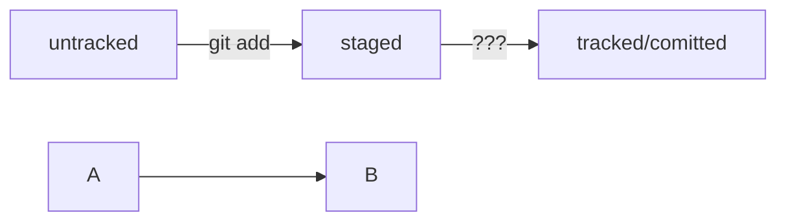

# Знания по Git
## Те которыми можно поделиться
```BUSH
git add -all 
```
Сохранить все изминения

```bush
git status
```
уточнить статус изминений

```bush
git commit -m "Описание внесенных изминений"
```
совершить комит

```bush
git puch
```
Пропушить или отправить на удаленный изминения




_Хеш уникальный код для поиска коммита_ 
*Конец*
